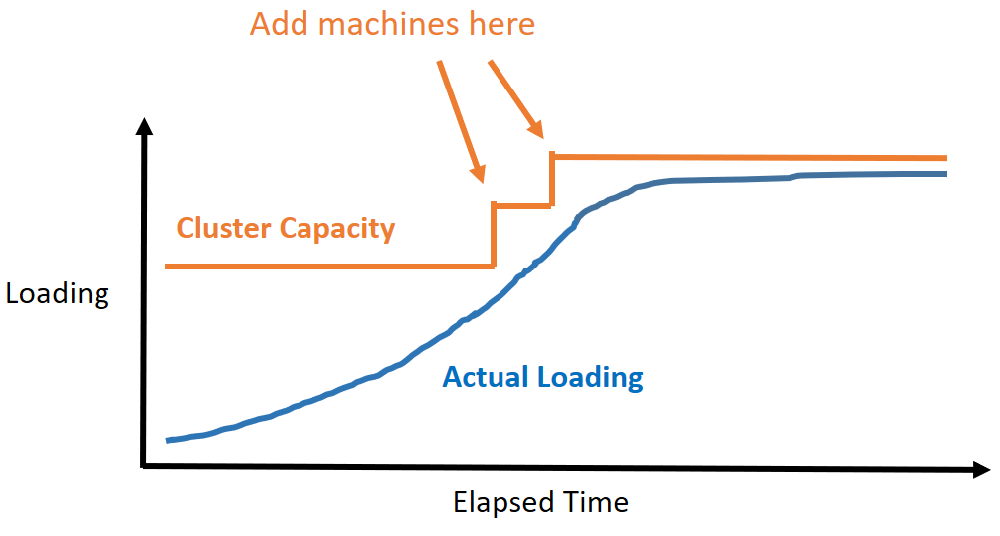

# SIGMOD'18 - P-Store: An Elastic Database System with Predictive Provisioning

## Motivation

DBMS machine provisioning is an important topic that controls the elasiticity and resource utilization of a distributed DBMS.

However, existing approaches always react slower than the actual demand.

## Problem

To design a system online reconfiguration strategy that reacts before the system overloaded such that:
- the resource used by the system is minimized
- the reconfiguration does not violate SLA.

Input:
- A prediction to the future workload
- The capacity of a machine

Output:
- When to add/remove machines
- How many machines to be added or removed

Assumptions:
- The target workload has periodic patterns that are easy to be predicted.
- There is no spike in the workload.
- Only a few distributed transactions.

This goal can be visualized as follows:

## Method

Two Parts:
- Workload Prediction
- Allocation Decision

### Workload Prediction

Models the workload as a time series data and uses Sparse Periodic Auto Regression to predict [USENIX'08]. 

Models the future workload at a time as a sum of a long-term pattern (past n days) and a short-term pattern (past m minutes).

### Allocation Decision

Use DP.

## Comments

- Pros
  - Works well on predictable workloads
- Cons
  - The workload must be easy to predict
  - The database must be easy to partition so that P-Store won't need to consider the impact of distributed transactions.

