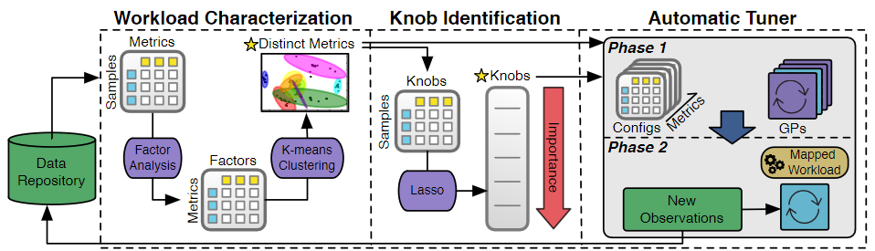
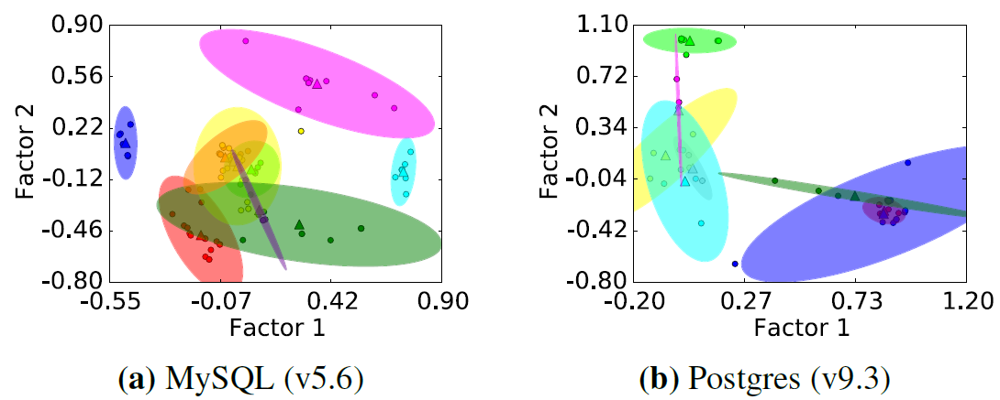
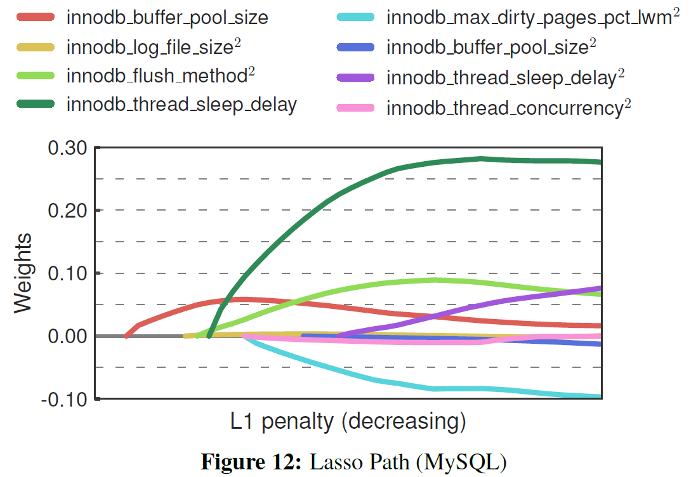

# Automatic Database Management System Tuning Through Large-scale Machine Learning

- Authors: Dana Van Aken, Andrew Pavlo, Geoffrey J. Gordon, Bohan Zhang
- Institute: CMU, Peking University
- Published at SIGMOD'17
- Paper Link: <http://www.cs.cmu.edu/~pavlo/papers/p1009-van-aken.pdf>

## Problem

To tune the configurations of a DBMS using ML models.

### Assumptions

- The tuner must have administrative privileges to modify the DBMS's configurations.
- The cost of restarting a DBMS is ignored.
- The physical design is reasonable.
  - Proper indexes, materialized views, other database elements have been installed.

## Method

### Workload Characterization

OtterTune collects the **internal** metrics because those metrics directly relate to the knobs and more predictable when tuning knobs.

- the number of pages read/writes
- query cache utilization
- locking overhead

#### How to Pick Up Useful Metrics

Some metrics may redundant because

- they are the same but in different units (MB/KB...)
- they are highly correlated

Steps:

1. Build a matrix \\(X\\) where \\(X_{ij}\\) represents the value of metric \\(i\\) on configuration set \\(j\\)
2. Performs Factor Analysis to reduce the dimension of \\(X\\) to \\(U\\) where \\(U_{ij}\\) represents the value of metric \\(i\\) on the \\(j\\)-th factor
3. Performs k-means clustering and pick up only the most representative metric in each cluster
   - \\(K\\) is determined by a heuristic algorithm without human intervention

Example Results:

### Knob Identification

- Use LASSO to evaluate the impact of each knobs
  - \\(X\\): knobs
  - \\(y\\): metrics
  - The most common feature selection algorithm
  - Computationally efficient
- Includes polynomial features to test if there is dependency between two knobs
  - For example, product "Buffer Pool Size" and "Log Buffer Size" as a feature to see if LASSO pick up this feature
- Use incremental approach (gradually increase the number of selected knobs/features and check the effectiveness)

Example Results:

### Automatic Tuner

Steps

1. Find the most similar workload in the past (workload mapping)
   1. Build a matrix \\(X_m\\) for each metric \\(m\\) where \\(X_{mij}\\) represents the value of metric \\(m\\) when running the DBMS on workload \\(i\\) with configuration set \\(j\\)
      - The values must be normalized.
   2. Compute euclidean distance for the target workload \\(i\\) with other rows in the same matrix
   3. Average the distance for each row/workload across matrixes as **scores**
   4. Choose the workload id with the lowest score as the most similar workload
2. Use Gaussian Process (GP) to predict the best configuration set

## Conclusion

Interesting insights

- Uses not only external metrics but also internal metrics for evaluating the performance of a configuration
- The way of picking up the useful metrics

## Questions

- How do they use the dependencies between knobs? Do those become features?
  - Not sure
- Do they use the variance given by Gaussian Process?
  - They use the variance as the confidence level
- Does OtterTune use any workload information such as queries or transactions for tuning?
  - No
