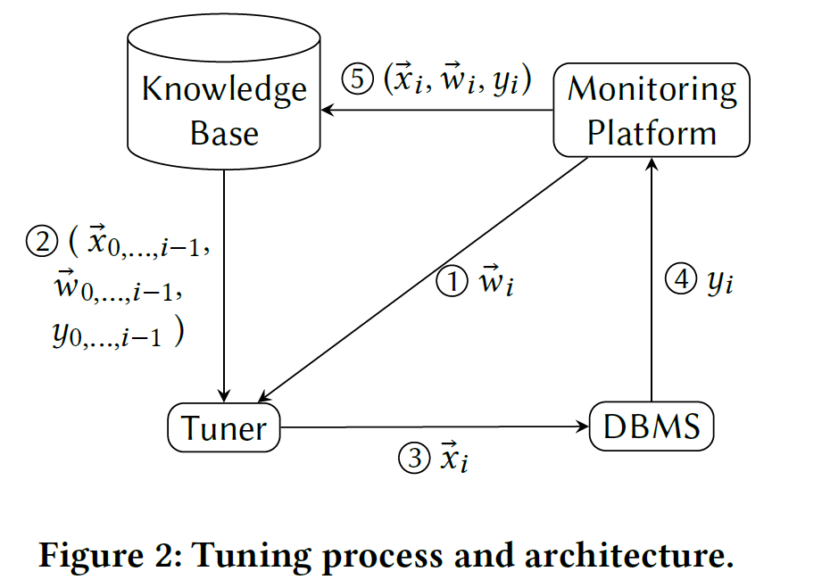
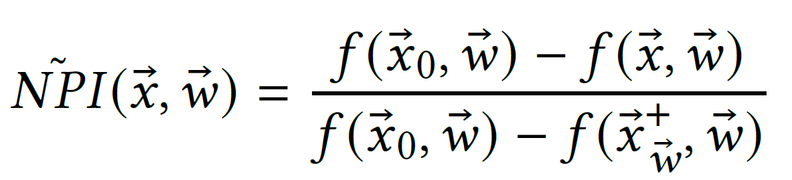

# CGPTuner: a Contextual Gaussian Process Bandit Approach for the Automatic Tuning of IT Configurations Under Varying Workload Conditions

- Authors: Stefano Cereda, Stefano Valladares, Paolo Cremonesi, Stefano Doni
- Institute:
    - Politecnico di Milano, Milan, Italy
    - Akamas, Milan, Italy
- Published at VLDB'21 (Vol. 14, No. 8)
- Paper Link: <http://vldb.org/pvldb/vol14/p1401-cereda.pdf>

## Background

A modern DBMS has hundreds of tunable configurations. Selecting a proper set of configurations is crucial for the performance of the system.

## Motivation

- Hundreds of parameters => large search space
- We also need to consider the parameters of IT stacks (e.g., OS, Java VM) to maximize the performance
    - which means more parameters to tune
- The same parameters may also not behave in the same way in different workloads (see Figure 1)

Figure 1: Cassandra under different YCSB workloads while varying two configurations

## Problem

Goal: To design a tuning algorithm able to consider the entire IT stack and continuously adapt to the current workload.

## Previous Work

- Needs to collect data offline
    - iTune
        - Uses Gaussian Processes to approximate the performance surface with different configurations
        - Con: Learned knowledge cannot be transferred between workloads, which means that we need to rebuild the model for each workload.
    - OtterTune
        - Has ability to reuse the past experience in other workloads to a new unseen workloads
        - Con: Requires to collect large amount of data set (over 30k trials per DBMS, about several months)
- Online Learning Methods
    - OpenTuner
        - Uses multiple heuristic search algorithm and dynamically selects the best one
        - Con? Unknown (TODO)
    - BestConfig
        - Iterative sampling strategy
        - Con? Unknown (TODO)

## Method

### Problem Modeling

A contextual bandit problem:

- Inputs (Context):
    - The current workload \\(\vec{w}_i \in W\\)
- Output (Action):
    - The configurations of the IT stack \\(\vec{x}_i \in X\\)
- The response of the system (Reward):
    - Certain performance indicator (e.g., throughput, latency...) \\(y_i \in \mathbb{R}\\)

Workflow:

### Main Idea

Bayesian Optimization using Gaussian Processes:

- The regression model: multi-variate Gaussian distributions
- Kernel: \\(k((\vec{x}, \vec{w}), (\vec{x}', \vec{w}')) = k(\vec{x}, \vec{x}') + k(\vec{w}, \vec{w}')\\)
    - where \\(k(a, a')\\) is Matérn 5/2 kernel for both \\(a = \vec{x}\\) and \\(\vec{w}\\)
- The acquisition function: the GP-Hedge method

Key Steps:

1. Sample a function \\( f_{\vec{w}_i}\\) using Gaussian Processes with previous observations \\( (\vec{x}_n, \vec{w}_n, y_n) \\) for \\( n = 0 ... i - 1 \\) and current workload \\(\vec{w}_i\\)
2. Using the acquisition function \\( a(.) \\) to optimize \\( max_\vec{x} a(f_{\vec{w}_i}, \vec{x}) \\) to obtain best \\( \vec{x} \\)

### Normalizing Performance

In order to avoid bad exploration due to zero mean sample far away from previous observation, they found that, instead of directly using the performance indicator \\( y_i \\), we should use Normalized Performance Improvement (NPI):

where \\( \vec{x}^+_\vec{w} \\) is the best configuration we have seen so far.

NPI must be re-normalized after each iteration since the best configuration may change.

## Experiments

## Conclusion

## Questions

- What does `vm.dirty_ratio` do?
- It seems like OpenTuner has already used multi-armed bandits to solve tuning problems. What are the differences between it and this work?

## Background Knowledge

TODO

- Baysian Optimization
- Gaussain Processes
- GP-Hedge methods
