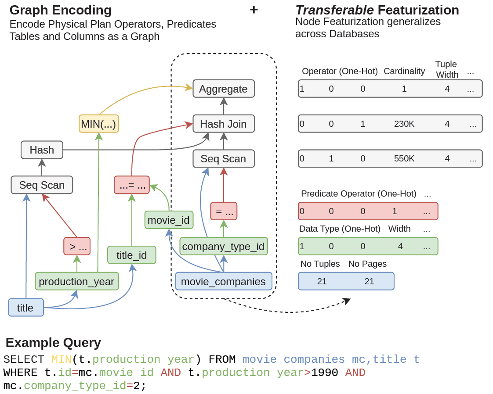

# One Model to Rule them All: Towards Zero-Shot Learning for Databases

- Authors: Benjamin Hilprecht, Carsten Binnig
- Institute: Technical University of Darmstadt, Germany
- Published at CIDR'22
- Paper Link: <http://cidrdb.org/cidr2022/papers/p16-hilprecht.pdf>

## Background

There have been many new proposals for using AI to improve DBMS components such as:

- More accurate cost estimators
- Faster query optimizers
- DBMS auto configurations (parameter tuning and physical design)

## Motivation

Those learning-based techniques usually require retraining once we apply them to a new database or workload, which may require great effort to collect training data.

## Problem

This paper aims to propose several techniques that help learning-based methods perform well when they are transferred to a new database without retraining.

## Method

### Key Insights

There are a few insights that may be the keys toward zero-shot learning techniques:

- Transferable representations of database and queries
  - In order to make a learning-based technique transferrable across databases, the format of representations should not depend on databases and queries.
- Training data collection and robustness
  - How to collect effective training data is important to enable zero-shot learning
  - A preliminary experiment shows that we can use a relative small training data set to outperform the state of the art when transferring from one database to another.
  - We need a way to guide us to find more effective training samples
- Separation of concerns
  - Decomposing a end-to-end model into smaller task-specific models help these small models more transferable across databases.

### Transferable Representations

Two key techniques:

- Graph Encoding
  - Modeling plan operator, predicates, table names as graph nodes
- Transferable Featurization
  - Using general statistics instead of database-specific features, such as number of tuples and pages.

## Experiments

The initial results show that their models outperforms the state of the art models on an unseen database (IMDB) without additional retraining.

## Conclusion

- Interesting direction
- Needs more descriptions on how to feature queries and other case studies
