# MB2: Decomposed Behavior Modeling for Self-Driving Database Management Systems

- Authors: Lin Ma, William Zhang, Jie Jiao, Wuwen Wang, Matthew Butrovich, Wan Shen Lim, Prashanth Menon, Andrew Pavlo
- Institute: Carnegie Mellon University
- Published at SIGMOD'21
- Paper Link: <https://dl.acm.org/doi/10.1145/3448016.3457276>

## Background: Creating a Self-driving DBMS

[51] proposes three main steps to build a self-driving DBMS:

1. Workload forecasting
    - Predicting the future workloads
2. Bahavior modeling
    - Predicting the runtime behavior relative to the target objective (latency, throughput) given the predicted workloads
3. Decision making/planning
    - Selecting the actions to improve the objective

## Motivation: Behavior Modeling

### Problem Formulation

Input:

- The workload
- The system state
- An action

Output:

- How long the action takes
- How much resource the action consumes
- How applying the action impacts the system performance
- How the action impacts the system once it is deployed

### Current Approaches

- White-box analytical methods [42, 45, 74]
    - Use a human-devised formula
    - Built for specific DBMSs
        - Different systems may use different formula
    - Con: difficult to migrate to a new DBMS
- ML methods
    - Use a ML model
    - Pro: more scalable and adaptable
    - Cons
        - Only designed for query cost estimation
            - E.g., uses query plan to predict latency
        - Current models do not consider OLTP workloads
        - Need accurate information for workloads (hard for predicting future workloads)

### Example

The impact of creating a secondary index on the TPC-C workloads with 4 and 8 threads.

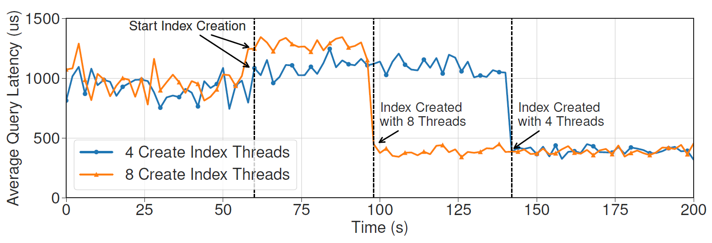

The behavior model must predict this impact with the given action.

### Challenges

- High dimensionality
    - Building a model to predict the performance of a DBMS must need a high-dimensional features, which impact the performance of the model.
- Concurrent operations
    - Many concurrent transactions must affect the predicted result.
- Training data collection v.s. Generalizability
    - To improve generalizability of a model, the system must collect more training data.
    - However, collecting training data also requires large amount of effort.

## Related Work

- ML Models
  - Mostly based on query plans
  - Needs to retrain the entire models if anything changes in the DBMS
  - Poor generalizability between workloads.
  - Focus on OLAP workloads
- Analytical Models
  - Mostly designed for a special purpose
    - for resource bottleneck
    - for cardinality estimation
    - for index defragmentation suggestions

## Goal

To design a general behavior modeling method.

### Assumptions

- Workloads are predictable
- In-memory DBMS with MVCC
- Supporting both OLTP and OLAP workloads
- Supporting capturing lock contention
- Does not consider aborts due to data conflicts

## Method

### Main Idea

Decomposing the DBMS into independent opearting units (OU), each of which represents a step to complete a specific task.

Then, MB2 creates a OU-runner and a OU-model for each OU:

- OU-runner: a runner to search input space, collect training data and train a model.
- OU-model: a ML model for the OU.

### Flow

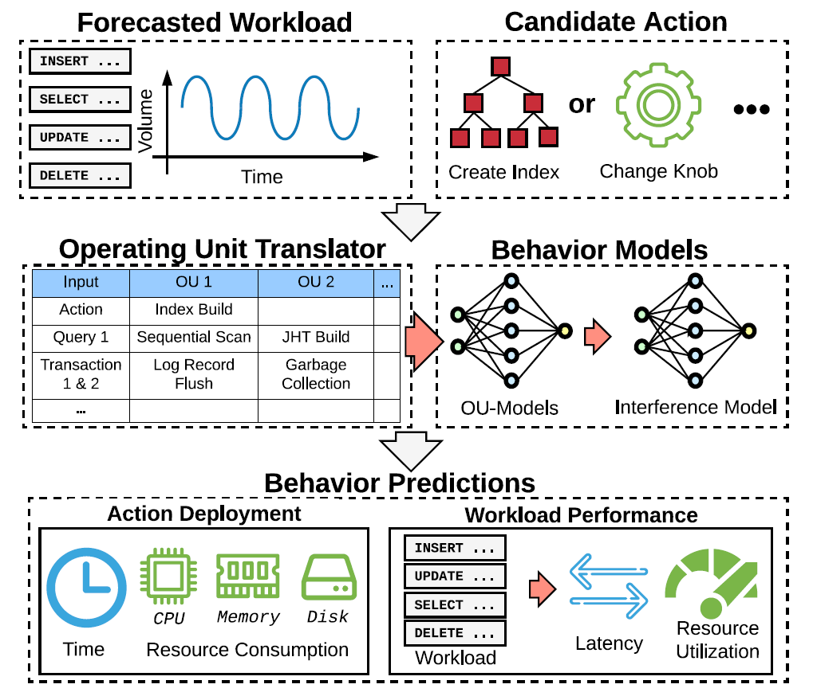

1. Given
    - a forecasted workloads
    - a candidate action
2. Translating the action to features for OU
3. Making all OU-models to predict the results
4. Using an interference model to adjust the results
5. Merging the results to the predicted system performance

### Operating Units (OU)

Key properties of an OUs:

- Independent: the runtime behavior of an OU is independent of other OUs.
    - E.g., Changing join hash table size does not affect WAL.
- Low dimensional: an model for an OU does not need many features to accurately predict the performance.
    - Insight: # of features = 10 is good
    - Divide an OU to multiple OUs if it needs more features.
- Comprehensive: OUs must cover all operations in a DBMS.

OU Examples:

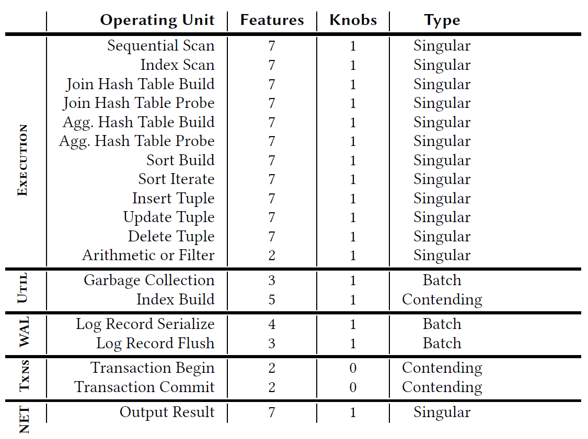

OU Types:

- Singular: focus on work and resource consumption for a single invocation.
- Batch: focus on a batch of work across OUs.
- Contending: focus on the work that may contend with other threads

### OU-Models

#### Input Features

- Singular
  - number of input tuples
  - number of columns of input tuples
  - average input tuple size
  - estimated key cardinality (e.g., sorting, joins)
  - payload size (e.g., hash table entry size for hash join)
  - number of loops (for index nested loop joins)
  - is interpreter or JIT-compiled
- Batch
  - total number of bytes
  - total number of log buffers
  - log flush interval
- Contending
  - number of tuples
  - number of keys
  - size of keys
  - estimated cardinality of the keys
  - number of parallel threads

In addition to the above features, it also append tuneable configurations (knobs) for the OU to the features as inputs.

#### Output Labels

- elapsed time
- CPU time
- CPU cycles
- CPU instructions
- CPU cache references
- CPU cache misses
- disk block reads
- disk block writes
- memory consumption

Note that the labels are the same for all OUs, so that MB2 can combine them together easier.

#### Problems of collecting data with OLAP queries

OLAP queries usually takes much more time to process, which lead to high overhead of collecting training data for them.

In order to overcome this, they normalize the output labels by the number of tuples so that we can train the model with queries that access less tuples.

The value is normalized according to the following observation:

- They observed that the value of output labels is usually a complexity related to n (number of tuples) times a constant.
- So, they normalize the values by dividing the complexity.
- A special case: memory consumption for building hash tables.

### The Interference Model

To adjust the outputs of OU-models due to resource competition between OUs.

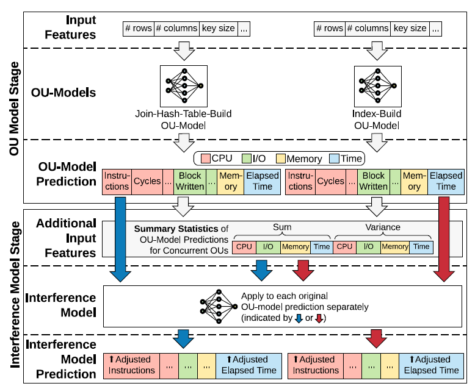

#### Key Ideas

- Normalized the inputs by the elapsed time.
- Predicting the ratio of the actual values and OU-model's predicted values.

The key ideas is based on an observation:

> We observe that under the same concurrent environment,
OUs with similar per-time-unit OU-model estimation (part of the
interference model’s inputs) experience similar impacts and have
similar output ratios regardless of the absolute elapsed time.

#### Inputs

- A OU-model's output labels
- Summary statistics of the OUs forecasted to run in the same time interval (e.g., 1 minute)
  - Sum
  - Variance

Normalized by dividing inputs by the target OU-model's estimated elapsed time.

#### Outputs

Same output labels with the input OU-model, but the values are the ratio between actual metrics and the original predicted metrics. The ratios usually >= 1 since an OU runs faster by itself.

### Training Data Collection and Training

Assumption: off-line

#### Components

- OU Translator: translating queries and actions to OUs' inputs.
- Resource Tracker: tracking the elapsed time and resource consumptions for each OU.
  - Use user- and kernel-level functions to track.
- OU-Runner: a microbenchmark to generate data for all possible inputs for each OU.
  - Inputs are generated in fixed-length and exponential step sizes.
  - MB2 will normalize the output labels, which greatly reduces the number of training data that need to be collected.
  - Can be executed concurrently with other OU-runners for training the inference model.
    - Parameters for using concurrent runners:
      - Which subsets of queries to execute
      - The number of concurrent threads in the DBMS
      - The workload submission rate.

#### Handling the inference of tracking data from other OUs

Challenges when collecting training data:

- multiple threads produce metrics in the same time and thus requires coordination
- too many resource tracker may incur a noticeable cost.

These issues are addressed by:

- Makes each thread tracks their own metrics and uses a dedicated aggregator to gather these data and store together.
- Turning off other OUs' resource tracker during collecting data.

#### Challenges for collecting data for OLTP queries

- High variance due to hardware (e.g., CPU scaling) and background noise (e.g., kernel tasks)
  - Solution: execute OU-runner for each OU with sufficient repetitions (10 times) and applies robust statistics.
    - Uses 20% trimmed mean statistics
- A DBMS may execute OLTP queries as prepared statements
  - Solution: execute each query 5 times for warm-up
- Other details:
  - Starts a new transaction for each execution to avoid data residing in CPU caches.
  - If a query modifies database state, revert the query by rolling back the transaction.

Labels are insensitive to the trimmed mean percentage and number of warm-ups.

#### Models Selection

MB2 selects and trains models for each OU and the inference model in the following steps:

1. Split the training data to train/validation set (8:2)
2. Train the following models and perform cross-validation
   - Linear regression
   - Huber regression
   - SVM
   - Kernel regression
   - Random forest
   - Gradient boosting machine
   - Deep neural network
3. Select the one with the highest validation score
4. Train the selected model with all available training data

#### For system updates

MB2 only needs to retrain the OU-models for the affected OUs.

## Experiments

### Environment

- Hardware:
  - 2 x Intel Xeon E5-2630v4 CPUs (20 Cores)
  - 128 GB RAM
  - Intel Optane DC P4800X SSD (NVMe)
- OS: Ubuntu 18.04 LTS
- DBMS: NoisePage
- ML Framework: scikit-learn
  - All parameters remain default:
    - Random forest: 50 estimators
    - Deep NN: 2 layers with 25 neurons
    - Gradient boosting machine: 20 depth & 1000 leaves

### Benchmarks

OLTP-Bench [13]:

- SmallBank: OLTP, 3 tables, 5 tx types
  - Models customers interacting with a bank branch
- TATP: OLTP, 4 tables, 7 tx types
  - Models cell phone registration service
- TPC-C: OLTP, 9 tables, 5 tx types
  - Models warehouses fulfilling orders
- TPC-H: OLAP, 8 tables, long-length queries
  - Models business analytics workload

### Evaluation Metics

- Relative Error: \\(\frac{|Actual - Predict|}{Actual}\\) for OLAP workloads
- Average Absolute Error: \\(|Actual - Predict|\\) per OLTP query template

### Training and Model Cost

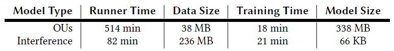

Key results:

- 1M unique data points for 19 OUs
- Average Inference time
  - OU translator for a query: 10 𝜇s
  - OU model for a query: 0.5 ms
- Average resource tracker invocation time: 20 𝜇s

### OU-Model Accuracy

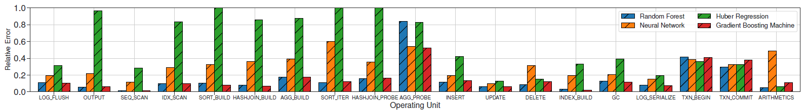

Key insights:

- More than 80% of the OU-models have an average error < 20%
- Transaction OU-models and probing an aggregation hash table have higher relative error because most cases have short elapsed time (< 10 𝜇s), which leads to high variance.
- Random forest and gradient boosting machine perform best
- Deep NN have higher error because most of them overfit on low dimension data.
- Huber regression is also effective for simple OUs and cheaper to train.

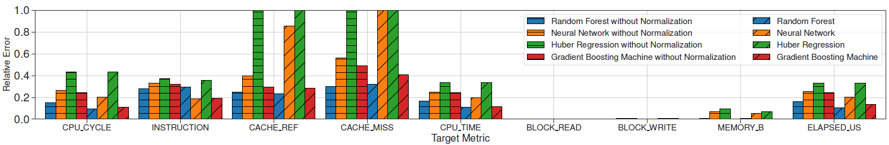

Key insights:

- Most labels have an average error < 20%
- Predicting cache miss is challenging because it depends on the content in the cache
- Normalization is effective

### Generalizability on Query Runtime Prediction

Baseline: QPPNet [26, 40]

- A tree-structured neural network
- The state-of-the-art on predicting query runtime
- Generalizability is good
- Disk-based

Training Method

- For OLAP, training on TPC-H 1G data set and testing on all other OLAP workloads.
- For OLTP, training on TPC-C data set and testing on all other OLTP workloads.

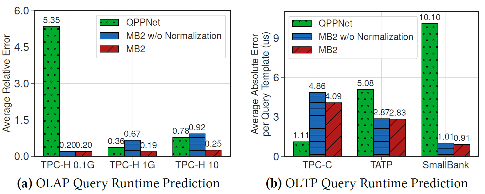

Key insights:

- OLAP
  - QPPNet achieves competitive performance on the workload it trains on, but it has higher errors on other workloads.
  - MB2 achieve better and stable performance across all workloads because the fine-grained OUs design.
  - Output normalization technique helps.
- OLTP
  - MB2 has higher error on TPC-C, but it generalizes better to other workloads.
  - Output normalization does not help too much.

### The Interference Model

Settings:

- The interference model uses deep NN (which performs best).
- Executes the queries in both single-thread and concurrent environments and compare the true adjustment factors against the predicted adjustment factors

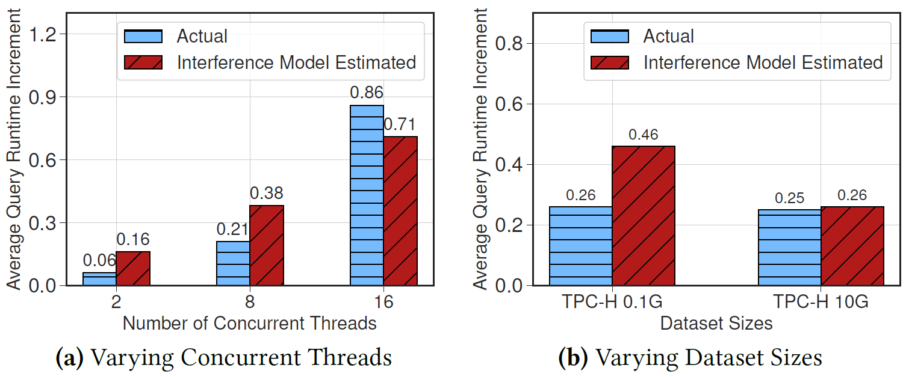

Key insights:

- The interference model has less than 20% error in all cases.
- Small data set size results in higher variance in the interference, so the model has higher error.

### Model Adaptation and Robustness

#### System Updates

Settings:

- Simulate system updates of improving join hash table algorithm adding sleep time:
  - No sleep
  - Sleep 1 us very 1000 insertions
  - Sleep 1 us very 100 insertions
- MB2 retrains the OU-models for hash join
  - Takes 23 minutes (24x faster than retraining all OU-models)

They seems to put the wrong figure for this experiment. (Figure 9a)

#### Noisy Cardinality

Settings:

- Add Gaussian white noise (mean = 0, variance = 30%) on cardinality estimation, which is an important input features for OU-models

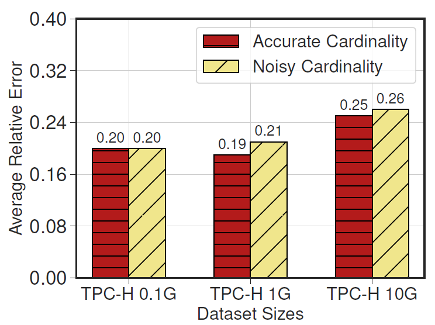

Key insights:

- Has almost no accuracy loss (< 2%)

### Hardware Adaptability by Adding Hardware Context as Features

Settings

- Adds CPU frequency as one of input features for OU-models
- Tests OU-models trained using different CPU frequency (1.2 ~ 3.1 GHz)

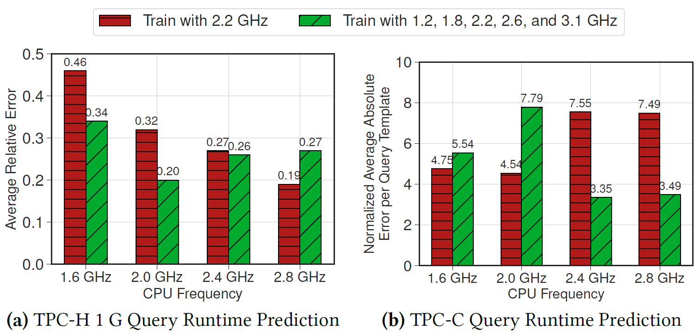

Key insights:

- Extending the OU-model with hardware context improves the prediction in most cases
- A special case where it performs notably worse is for the TPC-C workload under 2.0 GHz CPU
  - Because the models generally over-predict the runtime of the TPC-C queries.

### End-to-End Self-Driving Execution

Settings:

- Assumes
  - a forecaster that forecasts the average query arrival rate per query type in the next 10 seconds.
  - a decision maker that uses the estimated information to decide how to adjust the system.
- Workloads: daily transactional-analytical workload cycle
  - TPC-C: 20 warehouses, 50000 customers per district
  - TPC-H: 1GB
  - 10 concurrent threads
- Initial configurations that need to be updated
  - Interpretive mode (JIT works better)
  - No secondary index for customer tables

Goal: to see whether MB2 can accurately estimate the latency with given action plans.

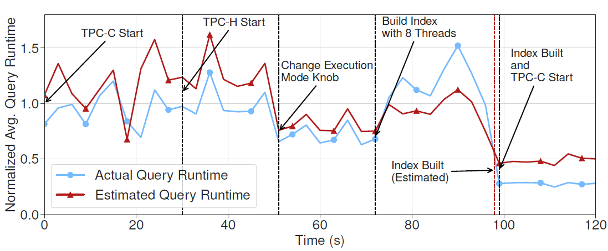

With workload changes and the decisions (changing execution mode and building an index), MB2 accurately predicts the latency.

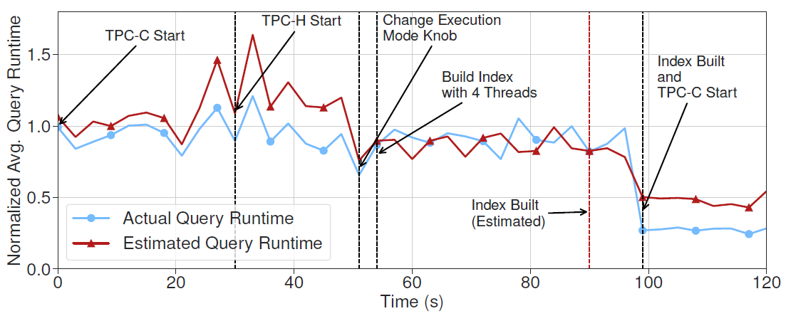

Even if we change the actions (building index with fewer threads), MB2 still manages to predict the latency accurately.

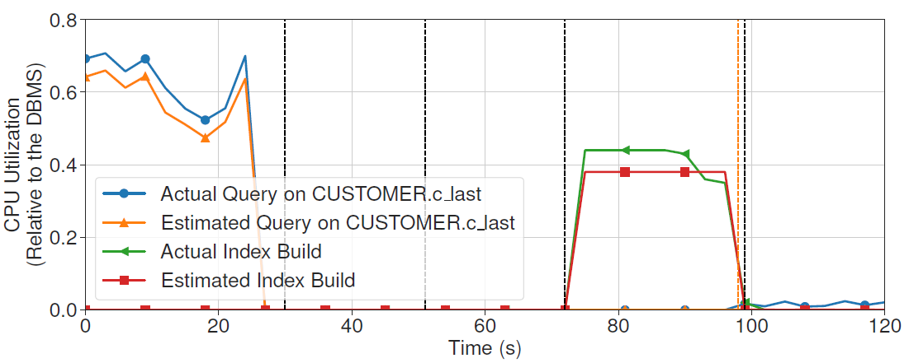

MB2 can also accurately predicts CPU utilization for each query.

## Conclusion

- Provides many useful insights and techniques for latency estimation.
- Solid experiments
- Due to the assumption of in-memory DBMS and MVCC, there is no discussion on modeling behaviors for disk I/Os and lock contentions.

## Questions

- Why does the paper emphasize "To orchestrate data collection across all OUs and to simulate concurrent environments, MB2 uses concurrent runners to execute end-to-end workloads (e.g., benchmarks, query traces) with multiple threads."? What does "concurrent runners" mean?
- What is "robust statistics"?
- Is it possible to predict the latency of a query without specify what action to perform for MB2?
